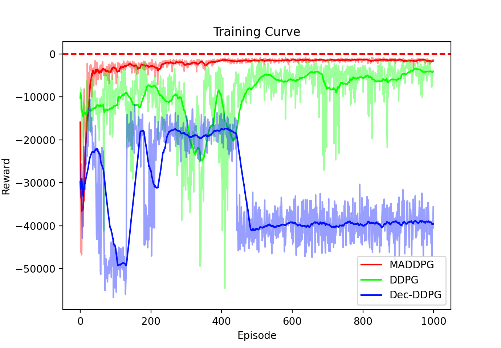

# MADDPG-Formation-Control

To install this projects dependencies, run

```req
pip install -r requirements.txt
```

Our project is dependent on OpenAI's Multi-agent Particle Environment with installation instructions [here](https://github.com/openai/multiagent-particle-envs).

The environment used is out of date, so in order to run it, the changes detailed [here](https://github.com/openai/multiagent-particle-envs/pull/54) must be made in the library.

## Training the Agents
We define two different training scripts depending on whether we want to train a centralized or decentralized agent.


### Centralized Agents
To train a centralized DDPG agent for 1000 episodes in a formation control with collision avoidance scenario, you can run the following command


```central
python centralized_experiment.py
```

Further control over the experiments can be gained through use of the command line options, defined as


```central-opt
usage: centralized_experiment.py [-h] [--scenario SCENARIO_NAME] [--num_eps NUM_EPS] [--save_images IMAGES] [--save_models SAVE_MODEL] [--load_models LOAD_MODEL] [--train TRAIN]
                                 [--save_suffix SAVE_SUFFIX] [--load_suffix LOAD_SUFFIX]

File to run experiments for som scenario with a centralized agent.

optional arguments:
  -h, --help            show this help message and exit
  --scenario SCENARIO_NAME
                        Name of the scenario we want to run: formation_w_coll_avoidance, formation_w_goal or simple_formation
  --num_eps NUM_EPS     Number of episodes to train for.
  --save_images IMAGES  True to save images and gifs, anything else not to.
  --save_models SAVE_MODEL
                        True to save models, anything else not to.
  --load_models LOAD_MODEL
                        True to load models, anything else not to.
  --train TRAIN         True to train models, anything else not to.
  --save_suffix SAVE_SUFFIX
                        Suffix for saving the file.
  --load_suffix LOAD_SUFFIX
                        Suffix for loading the file.
```

### Decentralized Agents
To train a set of MADDPG agents for 1000 episodes in a formation control with collision avoidance scenario, you can run the following command


```decentral
python decentralized_experiment.py
```

Further customization of the experiment and the agents are available through the options

```decentral opt
usage: decentralized_experiment.py [-h] [--agent AGENT] [--scenario SCENARIO_NAME] [--num_eps NUM_EPS] [--save_images IMAGES] [--save_models SAVE_MODEL] [--load_models LOAD_MODEL]
                                   [--train TRAIN] [--save_suffix SAVE_SUFFIX] [--load_suffix LOAD_SUFFIX]

File to run experiments for som scenario with a centralized agent.

optional arguments:
  -h, --help            show this help message and exit
  --agent AGENT         Name of the agent types: Valid values are 'decddpg' and 'maddpg'
  --scenario SCENARIO_NAME
                        Name of the scenario we want to run: simple_formation or formation_w_goal or formation_w_coll_avoidance
  --num_eps NUM_EPS     Number of episodes to train for.
  --save_images IMAGES  True to save images and gifs, False not to.
  --save_models SAVE_MODEL
                        True to save models, False not to.
  --load_models LOAD_MODEL
                        True to load models, anything not to.
  --train TRAIN         True to train models, anything else not to.
  --save_suffix SAVE_SUFFIX
                        Suffix for saving the file
  --load_suffix LOAD_SUFFIX
                        Suffix for loading the file
```

## Evaluating an Agent

To evaluate either agent after training, simply set the save\_images option for either script to 'True'. For an example, with the decentralized agent


```decentral
python decentralized_experiment.py --save_images True
```

Alternatively, if you wish to evaluate an agent with saved agent models, one can load the agents given the loading suffix, if one was used when saving the agents, and by setting the training option to false. For example

```decentral
python decentralized_experiment.py --save_images True --load_models True --load_suffix <SUFFIX-USED-WHEN-SAVING-MODEL> --train False
```

## Results
Below, we include the training curves for the different agents on the formation control with collision avoidance and a goal scenario.



Find the associated graphs for the trajectories and errors below.

TMP PUT STUFF HERE

